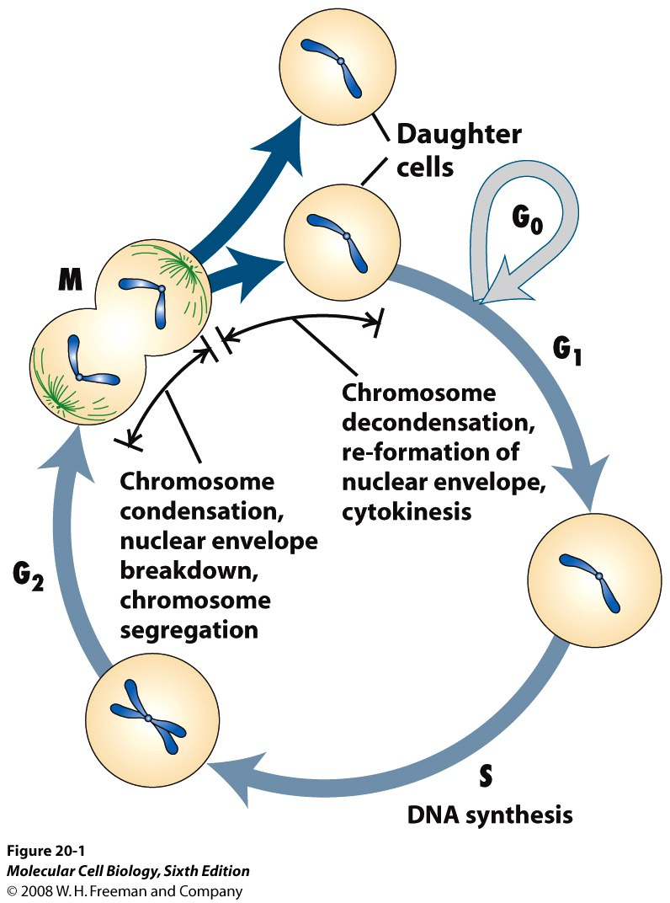
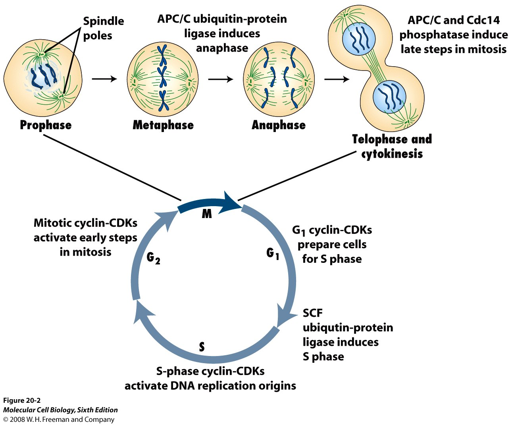
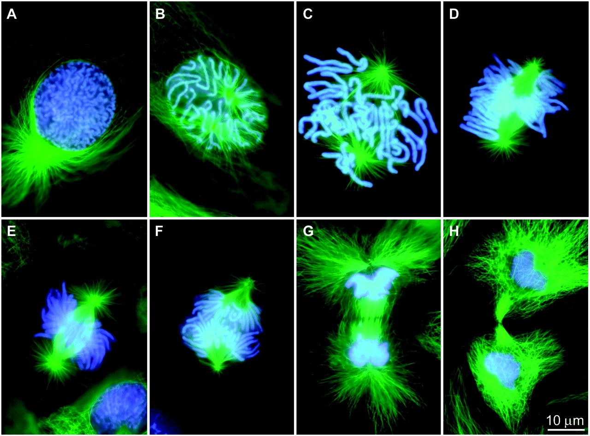
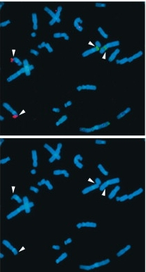
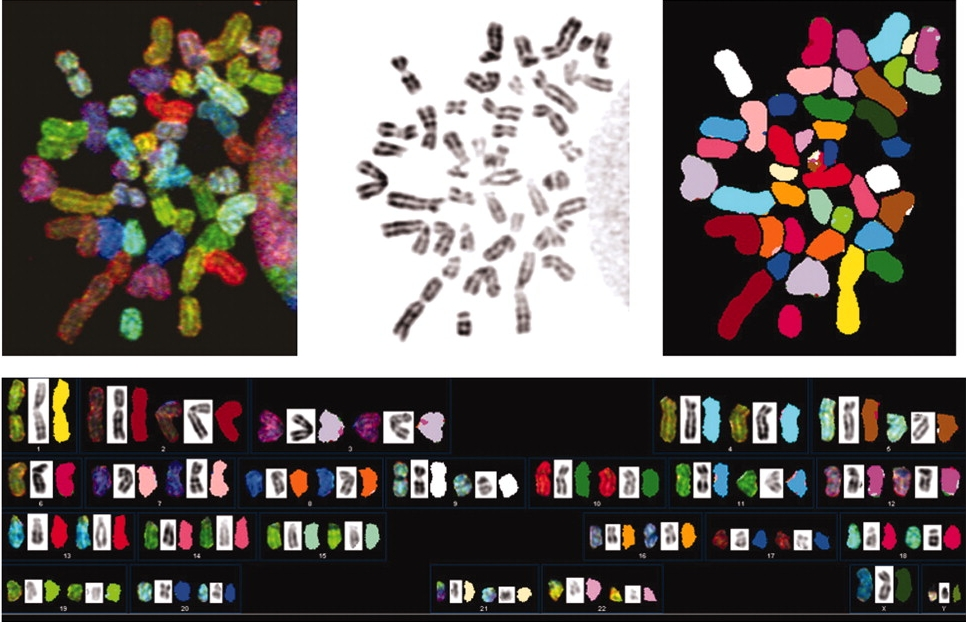
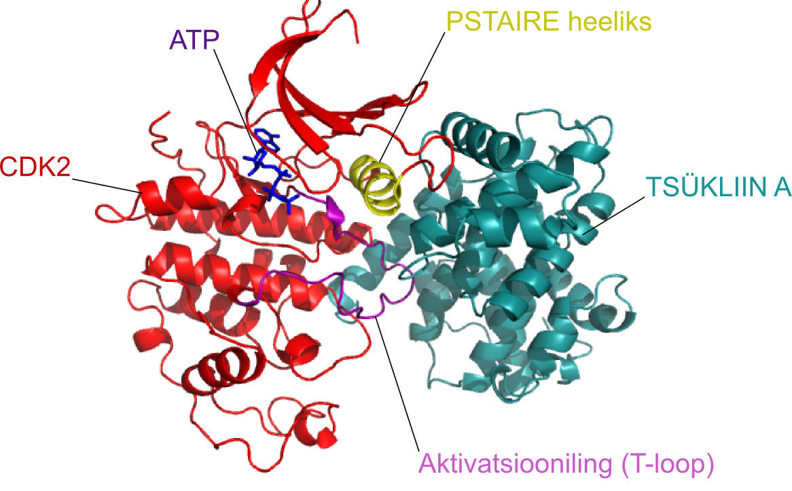
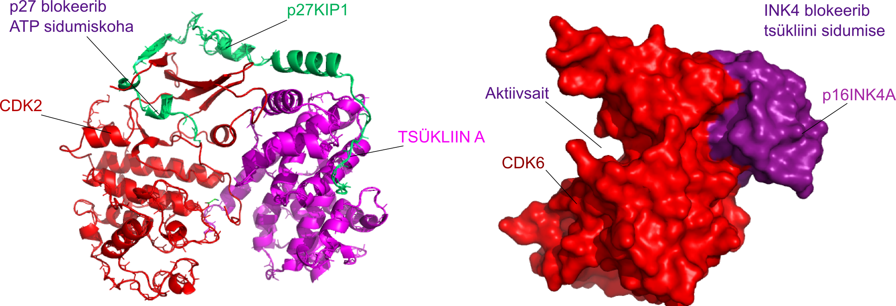
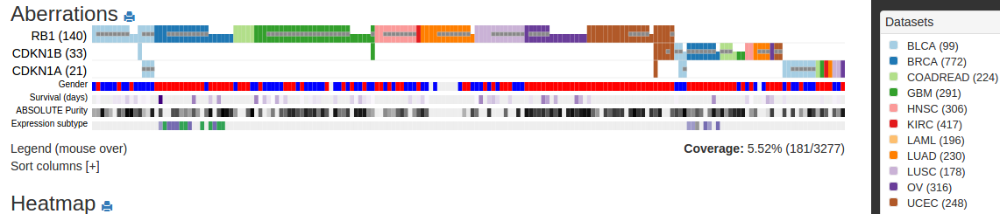

```{r setup, include=FALSE}
knitr::opts_chunk$set(echo = FALSE, fig.align = 'center')
```


## Rakutsükkel

- Rakutsükkel on järjestikuste sündmuste jada mille käigus rakk duplitseerib kõik oma koostisosad ja jaguneb kaheks tütarrakuks.

- Rakutsüklit kontrolliv 'masinavärk' on universaalne kõigis organismi rakutüüpides.

- Raku rakutsüklisse sisenemist ja 'masinavärgi käivitamist' reguleerivad raku väliskeskkonna signaalid.

---

## Rakutsüklit reguleerivad rakuvälised signaalid

- Eksponentsiaalselt kasvav imetajarakk peab peale igat raku jagunemist otsustama, 
    - kas kasvada ja jaguneda veel üks tsükkel või 
    - jääda vaikeolekusse.

- Seda otsust mõjutavad mitogeensed kasvufaktorid -- kui neid on piisavalt siis rakk jätkab jagunemist, vastasel juhul jääb rakk vaikeolekusse.


---

## Jagunemist reguleerivad füsioloogilised signaalid

- Türosiinkinaas retseptorid (mitogeenid)

- G-valk retseptorid (GPCR)

- TGF-beta retseptorid

- Integriinid

- Toitainestaatus


---

## Ka rakutsüklist väljumist reguleerivad rakuvälised signaalid

Ka raku vaikeolekuse minek võib olla aktiivselt reguleeritud.

- TGF-beta on keskne anti-mitogeen.

- Vaikeolek on rakkudel enamasti pöörduv.

- Rakke mis enam ei jagune ja on terminaalselt diferentseerunud nimetatakse **post-mitootilisteks**, nt. neuronid

---

## Rakutsükli faasid

.pull-left[

- **G1** algab peale mitoosi ja kestab kuni DNA replikatsiooni alguseni S faasis,
    - rakk kasvab ja valmistub sisenema S faasi
- **S-faas**is toimub genoomse DNA süntees
- **G2 faas** on intervall DNA sünteesi eduka lõpu ja mitoosis toimuva kromosoomide lahknemise vahel
    - suhteliselt lühike
    - mitoosis vajalike valkude süntees
- **M-faas** mitoos.
]

.pull-right[

```{r, out.width="\\linewidth"}

```

]

---

## Mitoosi faasid

.pull-left[

M-faasis toimub kromosoomide lahknemine

- **Profaasis** toimub kromosoomide kondenseerumine
      - Moodustub **mitoosikääv**
- **Metafaasis** joonduvad õdekromatiidid
- **Anafaasis** toimub õdekromatiidide lahknemine poolustele
- **Telofaasis** moodustub uuesti tuumamembraan ja tuum
- **Tsütokinees**: moodustub kaks tütarrakku

]
.pull-right[


```{r, out.width=260}


```

]

---

## Rakutsükli kontrollpunktid e *checkpoints*

1. G1-S DNA kahjustuste kontrollpunkt: S-faasi sisenemine on blokeeritud kui genoom on vigane.

2. S-faasi kontroll: replikatsioon aeglustub või seiskub vastusena DNA kahjustustele.

3. G2-M kontroll blokeerib raku mitoosi sisenemise kuni genoomi replikatsioon S-faasis on lõpule viidud.

4. eksisteerib veel hilise G2 dekatenatsiooni kontroll mis monitoorib, et kromosoomid ei oleks omavahel 'sõlmes'.

5. M faasis kontrollpunkt mis blokeerib sisenemise anafaasi kuni kõik kromosoomid on korrektselt käävile kinnitunud

---

## Genoomi replitseeritakse ainult üks kord 

**Rad17** sensorvalgu fosfrüleerimine ATRi poolt on vajalik DNA-kahjustuste ja __üheahelalise DNA__ poolt indutseeriud G2-faasi blokiks

.pull-left[

Komosoomi aberratsioonid RAD17 flox/− rakkudes. Metafaasi komosoomid:
- Katkenud komosoomid (all vasak, nool)

- Endoreduplitseerunud kromosoomid (all parem)

]

.pull-right[

```{r, out.width=200}
knitr::include_graphics("http://genesdev.cshlp.org/content/17/8/965/F4.medium.gif")
```
]


---

## Replikatsiooni kontrollpunkt

.pull-left[



]

.pull-right[

- **Seriin-treoniin kinaas ATR** tagab fragiilsete saitide stabiilsuse

- ATR aktiveeritakse vastuseks üheahelalisele DNA-le

- Aktiveeritud ATR fosforüleerib CHK1 kinaasi ja käivitatakse signaalirada mis viib rakutsükli blokini

]

---

## Käävi kontrollpunkt

Mitoosikäävi kontrollpunkt (*spindle assembly checkpoint*, SAC) hoiab ära aneuploidia tekke

.pull-left[

- **BUB1** mutatsioonid põhjustavad kromosomaalse ebastabiilsuse ja aneuploidsuse, üle 90% tahketest kasvajatest sisaldab kromosomaalseid aberratsioone.

- Bub1 on Ser/Tre-kinaas mis fosforüleerib ja inhibeerib APC/C kompleksi. APC/C on vajalik sekuriini Ub-sõltuvaks lagundamiseks, mistõttu vabaneb separaasi aktiivsus ja õdekromatiidid vabastatakse neid koos hoidvatest kohesiin 'rõngastest'.

]

.pull-right[

See BUB1-vaigistatud rakk on kaotanud kromosoomid 1 ja 6.


```{r, out.width=500}

```

]

---

## G1 restriktsioonipunkt

Tagab mitogeense kontrolli rakutsükli kulgemise üle

- Varases ja keskmises G1 faasis on S-faasi sisenemine seerumsõltuv.

    - Samuti on rakud tundlikud TGF-beta anti-mitogeensele toimele.
    
- Hilises G1 faasis on rakud juba pühendunud S-faasi sisenemisele ja ei sõltu enam rakuvälistest signaalidest.

---

## Rakutsükli masinavärki reguleerivad kinaasid

Rakutsükli kinaaside (**CDK**) substraadid:
- Tsentrosoomi valke (CP110) fosforüleeritakse G1/S üleminekul tsentrosoomi duplitseerumiseks

- Enne S-faasi aktiveeritakse replikatsioonikompleks (Treslin).

- Histoonide fosforüleerimine S ja M faasis kromatiini kondenseerumiseks.
- Tuumamebraani valkude (Lamiin) fosorüleerimine põhjustab tuumamembraani lagunemise M-faasis.

---

## Rakutsükli kinaasid (CDK)

- CDK on Ser/Tre-kinaasid.
- 40% aa järjestusest identsed.
- **CDK aktiveerub seostumisel tsükliiniga**
    - tsükliin E + CDK2 kompleksi kinaasne aktiivsus tõuseb 400000 korda.
    - Tsükliinid tagavad ka substraat spetsiifilisuse.

```{r, out.width=400, fig.align='center'}

```

.footer[Mechanism of CDK activation revealed by the structure of a cyclinA-CDK2 complex. Jeffrey, P.D.,  Russo, A.A.,  Polyak, K.,  Gibbs, E.,  Hurwitz, J.,  Massague, J.,  Pavletich, N.P. (1995) Nature 376: 313-320]

---
## Iga tsükliin paardub kindla kinaasiga kindlas rakusükli faasis
 
.pull-left[

```{r}
knitr::include_graphics("http://www.nature.com/nrc/journal/v13/n3/images/nrc3468-f1.jpg")
```

]

.pull-right[

```{r}
tab <- readr::read_delim("Tsükliini kinaas | Tsükliin | Rakutsükli faas
CDK4/6 | D1, D2, D3 | varane G1
CDK2 | E1, E2 | hiline G1, G1/S üleminek
CDK2 | A | S
CDC2 (CDK1) | A | S/G2
CDC2 | B | M", delim = "|")
tab <- knitr::kable(tab, format = 'html')
kableExtra::kable_styling(tab, "striped", position = "left", font_size = 10)
```

]

---

## Tsükliinide hulk rakus muutub rakutsükli käigus

- Tsükliine kontrollitakse läbi proteolüütilise lagundamise.
- Tsükliini järkjärguline tõus ja kiire lagundamine tagab rakutsükli 'hammasrataste' liikumise ühes sunas.
- **D-tsükliinid erinevad: nende puhu ei toimu järske kõikumisi rakutsükli käigus**
- **D-tsükliinid on reguleeritud mitogeensete signaalide poolt**

```{r}
knitr::include_graphics("http://upload.wikimedia.org/wikipedia/commons/thumb/c/ce/Cyclin_Expression.svg/1280px-Cyclin_Expression.svg.png")
```


---

## Rakutsükkel liigub ühes suunas

Tuuma tsükkel on koordineeritud raku kasvu ja pooldumisega.

- Replikatsioon peab toimuma vaid üks kord rakutsükli jooksul.

- Replikatsioon peab eelnema kromosoomide lahknemisele.

- Kromosoomide lahknemine peab omakorda olema toimunud enne tsütokineesi e. raku jagunemist.

---

## Erinevad mitogeensed rajad konvergeeruvad tsükliin D regulatsioonil

Kasvufaktorid stimuleerivad kiire tsükliin D taseme tõusu rakus, samuti kasvufaktorite 'ära võtmine' koekultuuri tingimustes viib tsükliin D lagundamiseni (poolestuseg ~30 min).

Kasvufaktorite rajad mis kontrollivad tsükliin D ekspressiooni:
- GF $\rightarrow$ **türosiin kinaas reseptorid** $\rightarrow$ Ras $\rightarrow$ Raf/RalGDS $\rightarrow$ Fos/Jun $\rightarrow$ D1
- GF $\rightarrow$ **HER2/Neu** $\rightarrow\rightarrow\rightarrow$ Sp1 $\rightarrow$ D1
- **Wnt** $\rightarrow$ **beta-kateniin** $\rightarrow$ Tcf/Lef $\rightarrow$ D1
- Tsütokiinid $\rightarrow$ tsütokiini retseptorid $\rightarrow$ **Jak $\rightarrow$ STAT** $\rightarrow$ D1
- **Hedgehog** $\rightarrow$ Patched $\rightarrow$ Smoothened $\rightarrow$ **Gli** $\rightarrow$ D1
- Erinevad ligandid $\rightarrow$ erinevad retseptorid $\rightarrow$ IKK $\rightarrow$ **NF-kB** $\rightarrow$ D1

---
## Kolme D-tüüpi tsükliini induktsioonimuster erineb

```{r}
tab <- readr::read_delim("Signaali allikas | Signaalirada | D tsükliini isovorm
RANK retseptor | NF-kB | D1
Prolaktiini retseptor | Jak/Stat | D1
Östogeeni retseptor | AP1 (Fos/Jun) | D1
Focal adhesion kinase |  | D1
HER2/Neu | E2F ja Sp1 | D1
Wnt-Frizzled | beta-kateniin-Tcf/Lef | D1
Bcr/Abl |   | D2
FSH retseptor | cAMP | D2
erinevad mitogeenid | Myc | D2
IL-4/7 retseptor |  | D2
IL-5 retseptor | STAT3/5 | D3
 | E2F transkriptsiooni faktorid | D3", delim = "|")
tab <- knitr::kable(tab, format = 'html')
kableExtra::kable_styling(tab, "striped", position = "left")
```

---

## Tsükliin D1 regulatsiooni mehhanismid

GF-Ras-Raf-Erk ja Wnt signaalirada kontrollib tsükliin D1 ekspressiooni ning stabiilsust ja GSK3beta on siin negatiivne regulaator.

- Stabiilne 5–6 tundi kestev ERK signalisatsioon indutseerib tsükliin D1 ekspressiooni kesk-G1 faasis (~8–9 tundi peale mitogeense stimulatsiooni algust vaikeolekus rakkudes)
- PI3-kinaas/Akt fosforüleerib glükogeen süntaasi kinaasi 3beta (GSK3beta) ja inhibeerib selle aktiivsuse
- GSK3beta fosforüleerib tsükliin D1 Thr286 mistõttu see translokeerub tuumast tsütoplasmasse ja satub lagundamisele
- Teisalt indutseerib Wnt signaalirada D1 ekspressiooni läbi beta-kateniini
    - beta-kateniini lagundamist kontrollib samuti GSK3beta
    - lisaks kontrollib GSK3beta p27Kip1 degradatsiooni

---

## Tsükliin D-CDK4/6 lükkavad raku läbi Restriktsiooni-punkti

- Rakud vastvad rakuvälistele mitogeensetele signaalidele kuni R-punktini
- **Peale R-punkti läbimist on tsükliinide E $\rightarrow$ A $\rightarrow$ B regulatsioon automaatne ja autonoomne**

---

## CDK inhibiitorid

Lisaks tsükliinidele reguleerivad tsükliin-sõltuvaid kinaase ka CDK inhibiitorid (CdkI).
Praeguseks on kirjeldatud seitse erinevat CdkI-d
- INK4 valgud (**in**hibitors of CD**K4**), mis inhibeerivad spetsiifiiselt ainult CDK4 ja CDK6
    - p16<sup>INK4A</sup> , p15<sup>INK4B</sup>, p18<sup>INK4C</sup>, p19<sup>INK4D</sup>
- p21<sup>Cip1</sup>, p27<sup>Kip1</sup>, p57<sup>Kip2</sup>: inhibeerivad kõiki teisi tsükliin-CDK komplekse

```{r, out.width=400}

```

.footer[Crystal structure of the p27Kip1 cyclin-dependent-kinase inhibitor bound to the cyclin A-Cdk2 complex. Russo, A.A.,  Jeffrey, P.D.,  Patten, A.K.,  Massague, J.,  Pavletich, N.P. (1996) Nature 382: 325-331. Structural basis for inhibition of the cyclin-dependent kinase Cdk6 by the tumour suppressor p16INK4a. Russo, A.A.,  Tong, L.,  Lee, J.O.,  Jeffrey, P.D.,  Pavletich, N.P. (1998) Nature 395: 237-243.]

---

## TGF-b indutseerib p15<sup>INK4B</sup>

- **TGF-beta peamine raku jagunemist pidurdav mehhanism töötab läbi p15<sup>INK4B</sup>**

- p15<sup>INK4B</sup> blokeerib tsükliin D-CDK4/6 komplekside moodustumise ja inhibeerib olemasolevaid

- Ilma aktiivse tsükliin D-CDK4/6 pole rakutsükkel võimeline arenema läbi varase ja keskmise G1 faasi R-punktini

- Kui rakk on juba R-punkti läbinud pole enam D-CDK4/6 aktiivsus vajalik

- Peale R-punkti muutub rakk 'tundetuks' ka TGF-b inhibeerivale toimele

- [CDKN2A/B lookuse naabruses asuv 9p21.3 lookus on üks sagedamini muteerunud piirkondi eri tüüpi vähkides](http://rpubs.com/tapa741/tuumorsupressorgeenid) (vt. Supplementary Table 3)

---

## p21<sup>Cip1</sup> aktiveeritakse vastusena stressile

- p21<sup>Cip1</sup> toimib läbi terve rakutsükli
- TGF-beta indutseerib nõrgalt ka p21<sup>Cip1</sup>
- **Peamine p21<sup>Cip1</sup> induktor on DNA kahjustused**
- p21<sup>Cip1</sup> inhibeerib E-CDK2, A-CDK2, A-CDC2, B-CDC2 komplekse
- Kui DNA kahjustused on parandatud, siis võetakse p21^Cip1 -blokk maha
- p21<sup>Cip1</sup> inhibeerib ka DNA replikatsiooni masinavärgi valku PCNA (*proliferating cell nuclear antigen*)

```{r}
knitr::include_graphics("http://www-bioc.rice.edu/~shamoo/threeclamps.jpg")
```

.footer[Pilt: p21 (A, punane) blokeerib PCNA-l (sliding clamp) DNA polümeraasi seostumiskoha (B, C). http://www-bioc.rice.edu ]

---

## Mitogeenne signalisatsioon inhibeerib p21<sup>Cip1</sup> ja p27<sup>Kip1</sup>

**PKB/Akt inhibeerib p21<sup>Cip1</sup> ja p27<sup>Kip1</sup> tuuma lokalisatsiooni**
- Akt seostub p21<sup>Cip1</sup> ja fosforüülib selle Tre-145, põhjustades tsütoplasma lokalisatsiooni
    - Akt raja blokeerimine dominant-negatiivse Akt mutandiga taastab p21Cip1 tuuma lokalisatsiooni ja rakkude jagunemist inhibeeriva toime
- Sarnaselt toimub p27<sup>Kip1</sup> inhibitsioon, seal fosforüülib Akt Tre-157
    - Aktiveeritud Akt ekspresseerivad rakkudes ei suuda p27WT tekitada G1 arresti
    - Tsütoplasmaatiline p27 esines 41% (52/128) inimese primaarsetes rinnavähkides kus on kõrge Akt aktivatsiooni, HER-2/neu-vahendatud raku jagunemine käib läbi Akt kinaasi ([Liang et al. 2002](http://www.nature.com/nm/journal/v8/n10/full/nm761.html))
    - Tsütoplasmaatiline p27 korreleerub halva prognoosiga

---

## p21<sup>Cip1</sup> ja p27<sup>Kip1</sup> seostumine on vajalik D-CDK4/6 aktivatsiooniks

.pull-left[

- Primaarsed hiire fibroblastid, milles puuduvad nii p21 ja p27 ei suuda moodustada aktiivseid tsükliin D-CDK komplekse,

    - ekspresseerivad palju vähem tsükliin D ning
    
    - neis ei lokaliseeru  tsükliin D tuuma
    
- Tsükliin D-CDK4/6 tase tõuseb rakus varases-keskmises G1 faasis ja korjab ära p21 ja p27 nii, et see ei saa inhibeerida tsükliin E-CDK2

]

.pull-right[

p21/p27 dko rakkudes on vähem tsükliin D-CDK komplekse [Cheng et al. 1999](http://emboj.embopress.org/content/18/6/1571.long).

```{r}
knitr::include_graphics("http://emboj.embopress.org/content/embojnl/18/6/1571/F8.large.jpg")
```

]

---

## CDK inhibiitorid imetajarakkude rakutsüklis

```{r, out.width=500, fig.cap='Schematic representation of the mammalian cell cycle.'}
knitr::include_graphics("http://physrev.physiology.org/content/physrev/85/2/523/F3.large.jpg?width=800&height=600&carousel=1")
```


.footer[Pilt: Physiological Reviews. DOI: 10.1152/physrev.00055.2003 ]

???

The cyclin D/cdk4–6 complex phosphorylates the Rb protein leading to sequential phosphorylation by cyclinE/cdk2 and the release of free E2F. Phosphorylation of Rb relieves transcriptional repression of genes involved in the induction of S-phase entry. The ability of the cyclin/cdk enzymes to phosphorylate Rb is inhibited by cyclin-dependent kinase inhibitors (cdkis), the activation of which thus suppresses cell proliferation. The basic helix-loop-helix (bHLH) proneural genes NeuroD, Mash1, and Ngn1 control the switch from cell proliferation to neural differentiation by activation of the Kip/Cip Cdki family, thus preventing progression through the G1-S phases. The HLH proteins Id1 and Id3 (inhibitor of differentiation) repress neuronal determination by direct binding with proneural bHLH proteins, but also favor progression through the cell cycle via inhibition of the INK4 and Kip/Cip Cdki families. Activating and inhibiting influences are represented by blue arrows and red lines, respectively.

---
class: inverse, middle, center

# pRb ja restriktsioonipunkti kontroll

---

## Viiruste onkogeenid seovad pRb-d

- pRb tuumorsupressor tundub viirustele olulise märklauana:

    - Inimese adenoviirus tüüp-5 E1A onkogeen seob pRb-d
    
    - HPV E7 seob pRb-d
    
    - SV40 largeTAg seob pRb
    
- Need viiruste onkogeenid seovad hüpofosforüleeritud pRb valku

    - hüpofosforüleeritud pRb on funktsionaalselt oluline

---

## RB fosforülatsioon reguleerib restriktsioonipunkti läbimist

.pull-left[

```{r}
knitr::include_graphics("http://blogs.shu.edu/cancer/files/2014/08/figure_08_19-1024x903.jpg")
```
]

.pull-right[

- Kui rakud läbivad M/G1 ülemineku, siis RB defosforüleeritakse täielikult (PP1 fosfataas)
- G1 faasis tsükliin D-CDK4/6 hüpofosforüleerib RB
- Hüpofosforüleeritud RB muutub tsükliin E-CDK2 substraadiks ja hüperfosforüleeritakse
- RB jääb hüperfosforüleerituks kogu ülejäänud raku tsükli (kuni jälle G1-ni)
]

---

## RB valgud ehk 'taskuvalgud' (*pocketproteins*)

- RB, p107 ja p130 moodustavad 'taskuvalkude' perekonna
- RB on 25% homoloogne ülejäänud kahega ja p107 ning p130 on omavahel 54% identsed
- RB *knockout* on hiirele embrüonaalselt surmav, kuid p107 või p130 *knockout* -il pole silmaga nähtavat fenotüüpi
- RB omab tugevat tuumorsupressorfunktsiooni ja p107/p130 mutatsioonid on vähkides harvad

```{r}
knitr::include_graphics("http://www.nature.com/nrm/journal/v14/n5/images/nrm3567-i2.jpg")
```

.footer[Molecular mechanisms underlying RB protein function. Frederick A. Dick & Seth M. Rubin. Nature Reviews Molecular Cell Biology 14, 297-306 (May 2013) doi:10.1038/nrm3567]

---

## RB valgud toimivad läbi E2F

- Hüpofosforüleeritud pRB seostumine maskeerib aktivaatoritel transkriptsiooni aktivatsiooni domääni
- Repressorvalkude E2F4 ja E2F5 seostumine taskuvalkudele (peamiselt p107 ja p130) moodustab E2F märklaudgeenide promootoritele repressorkompleksid
- Hüpofosforüleeritud RB valgud seostuvad ka DNA-l olevatele E2F valkudele vaigistades niimoodi geeniekspressiooni. Kompleksi 'tõmmatakse' ka histooni deatsetülaas HDAC mis muudab kromatiini struktuuri transkriptsioonile mittepermissiivseks
- pRB seostub eelkõige E2F1-3 valkudele ning p107 ja p130 E2F4/5

.pull-left[

```{r}
knitr::include_graphics("http://www.nature.com/nrm/journal/v9/n9/images/nrm2469-i1.jpg")
```


]

.pull-right[

```{r}
knitr::include_graphics("http://www.nature.com/nrm/journal/v14/n5/images/nrm3567-f2.jpg")
```
]

---

## Imetajate E2F TF perekond

- Kaheksa geeni E2F1-8, kolm toimivad aktivaatoritena (E2F1-3a) ja ülejäänud repressoritena (E2F3b-8)
- E2F1-6 valgud sisaldavad  DP1,2 (*dimerization partner protein*) heterodimerisatsiooni domääni ja seostuvad DNA-le heterodimeerina koos DP valguga
- E2F1-5 valgud seovad RB 'taskuvalke' üle C-terminaalse domääni
- Taskuvalgud pRB, p107 ja p130 seovad E2F ainult hüpofosforüleeritud olekus

```{r, out.width=360}
knitr::include_graphics("http://www.ijbs.com/v01/p0087/ijbsv01p0087g02.gif")
```


.footer[Pilt: Signalling In The Epidermis: The E2f Cell Cycle Regulatory Pathway In Epidermal Morphogenesis, Regeneration And Transformation, doi:10.7150/ijbs.1.87 ]

---

## pRB valkude E2F TF seostumiskoht on konserveerunud

```{r}
knitr::include_graphics("http://genesdev.cshlp.org/content/16/24/3199/F3.large.jpg")
```


- Rb tasku on konserveerunud (mida punasem seda konserveerunum) nii eri liikidel kui valgu isovormidel p107 ja p130 valkudel ([Lee et al. 1998](http://www.nature.com/nature/journal/v391/n6670/full/391859a0.html)). Kollane on E2F2 peptiid mis on seostunud taskusse. 
- Tärniga nool näitab B-domäänil asuvat LxCxE-motiivi sisaldavate valkude (HPV E7) seostumiskohta ([Lee et. al 2002](http://genesdev.cshlp.org/content/16/24/3199.full))
- HPV E7 valgu seostumine RB-le rikub 'tasku' konformatsiooni nii, et see ei saa enam siduda E2F valke

---

## Transkriptsioonist sõltumatu pRb rakutsükli regulatsioon

- pRb stabiliseerib p27Kip1
- pRb vahendab ka p27 proteolüütilist lagundamist vahendava Skp2 degradatsiooni
- Skp2 on ubikvitiini ligaasi kompleksi p27 ära tundev subühik
- RB seob Skp2 üle oma C-terminaalse domääni ja esitleb selle APC/C (*anaphase-promoting complex/cyclosome*) lagundamisele
- APC seostub RB B-boxi LxCxE-motiivi sisaldavate valkude seostumiskohta

```{r, out.width=400}
knitr::include_graphics("http://www.nature.com/nrm/journal/v14/n5/images/nrm3567-f3.jpg")
```

---

## pRB hüperfosforüleerimist võimendab positiivne tagasiside

G1/S faasi kiire ülemineku tagavad positiivse tagasiside mehhanismid
- **Tsükliin E transkriptsiooni reguleerib E2F** ja hüpofosforüleeritud RB repressioonist vabanev E2F võimendab edasist kiiret RB hüperfosorüleerimist läbi tsükliin E-CDK2
- **p27Kip1 on tsükliin E-CDK2 substraat** ning fosfo-p27 määratakse ubikvitiin-proteasoomsele lagundamisele

---

## Vähis mitmeid strateegiaid RB funktsiooni tasalülitamiseks, MYC

- RB geeni mutatsioonid retinoblastoomis, osteosarkoomis ja väikserakulistes kopsukasvajates
- HPV E7 seostumine pRB-le inaktiveerib selle >99.7% emakakaela vähkides
- bHLH tf **Myc** on üle ekspresseeritud 15-30% vähkides
- **Myc-Max** tf aktiveerib tsükliin D2 ja CDK4 transkriptsiooni
- Lisaks aktiveerib Myc-Max ka Cul1 transkriptsiooni, mis on SCF(SKP2) sisaldava kompleksi E3 ubikvitiin ligaas ja ubikvitineerib p-p27kip
- **Myc-Miz1** tf inhibeerib aga p15INK4B ning p21Cip1, p27Kip1 transkriptsiooni
- Myc aktiveerib E2F1/2/3 geenide transktriptsiooni

---

## Tsükliini kinaasi inhibiitorid toimivad läbi RB

- D-tsükliini inhibiitorite p15/p16 mutatsioonid ja RB mutatsioonid välistavad teineteist vähkides

```{r}

```


.footer[Link andmetele: [RB vs CDKIs](http://magi.brown.edu/view/db47b1d08798145230a159ea3e0ffd54)]

---

## Normaalselt TGF-b supresseerib Myc ekspressiooni

Võttes arvesse Myc-i võimet p15<sup>INK4B</sup> ekspressioon kinni panna ja seega TGF-beta jagunemist kontrolliv mõju nullida, siis
- **normaalsetes rakkudes on Myc geen siiski TGF-beta raja kontrolli all**
    - Smad3-4 aktiveerib koos Miz1 tf p15INK4 geeni ekspressiooni.
    - SMAD3 istub koos E2F4/5 (repressiivsed E2F valgud), p107 ja C/EBPbeta valkudega Myc geeni promootoril ja paneb sellelt transkriptsiooni efektiivselt kinni.
- Vähkides on TGF-b raja mutatsioonid sagedased: Smad4 mutatsioonid, TGF-b retseptori mutatsioonid

```{r}
tab <- readr::read_delim("Rakud | p15INK4B | p21Cip1 | p57Kip2 | c-MYC
epiteeli eellasrakud | üles | üles |  | alla
neuraalsed eellasrakud, astrotsüüdid | üles | üles |  | alla
hematopoeetilised eellasrakud | | | üles | alla
T rakud | | üles | | alla", delim = "|")
tab <- knitr::kable(tab, format = 'html', caption = 'Erinevates rakutüüpides CdkI üles-regulatsioon varieerub vastusena TGF-beta stimulatsioonile, kuid Myc alla-regulatsioon on universaalne.')
kableExtra::kable_styling(tab, "striped", 
                          position = "left", 
                          font_size = 12)
```

---

## Molekulaarsed muutused kasvajates mis viivad rakutsükli deregulatsioonini

[Erinevat tüüpi kasvajates kuni 90% vähke sisaldab muutusi rakutsükli regulatsioonis.](cellcyclecancer.html)


---
class: inverse, center, middle

## Lingid

---
class: inverse, middle

Onkobioloogia loengu:
- [Rakutsüklikontroll](http://tpall.github.io/Rakutsyklikontroll)

GitHub:
- [tpall/rakutsykliloeng](https://github.com/tpall/rakutsykliloeng)
